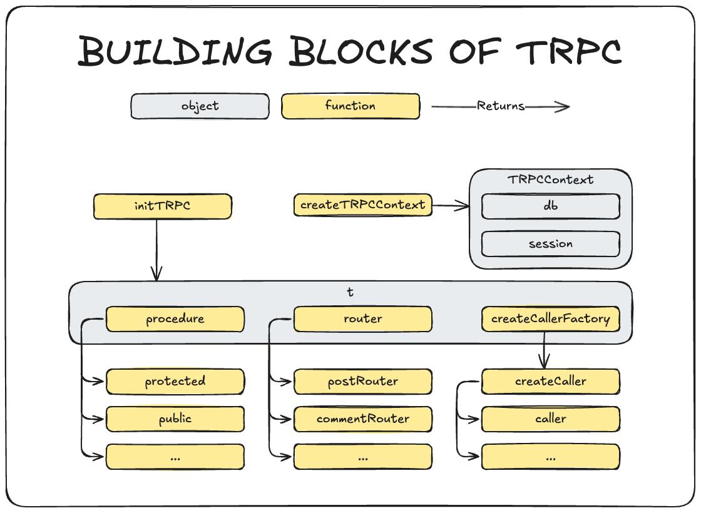

This is a primer on using TRPC on your Typescript backend. It assumes familiarity with Typescript and some basic server concepts. It's written for NextJS but it's suitably broad to apply to any Typescript framework (Deno, Bun, etc.).

It's also deliberately quite high-level. It's missing a lot of the good stuff they put in the frontend. To see more of what you're missing out on, reference the official docs [here](https://trpc.io/docs/concepts).

Once you've got the pattern down you can move to part 2, where we'll learn to to customise TRPC for our needs.

## Standard Configuration

Throughout this guide I will refer to "standard configuration". This is the typical setup encountered when we see TRPC integrated into NextJS. I am using the default configuration provided by [T3 Stack](https://create.t3.gg/). It has become the de facto standard for TRPC integration and can be taken as a best practices example. You can familiarise yourself by spinning up a new T3 Stack project and selecting TRPC.

## Visualising TRPC



Disclaimer: This diagram is not 100% accurate. Nor is it 90% accurate. But it does make sense! Reference this as you work through each section.

## Context

Context is a simple but important concept in TRPC. It affects everything you see in the hierarchy.

Context definition (from the docs):

> Stuff that every procedure can access

That nicely sums it up tbh.

```ts: src/trpc/server.ts
// src/trpc/server.ts
export const createTRPCContext = async (opts: { headers: Headers }) => {
	const session = await getServerAuthSession();

	return {
		db,
		session,
		...opts,
	};
};
```

`createTRPCContext` is a function that returns the context object.

- db: Database object from a database provider or ORM of your choice
- session: Session object from AuthJS
- opts: Headers from the incoming request

## The TRPC object "t"

The TRPC object is a collection of related things. It's called "t" because naming things is hard.

```ts: src/server/api/trpc.ts
// src/server/api/trpc.ts
const t = initTRPC.context<typeof createTRPCContext>().create({
	transformer: superjson,
	errorFormatter({ shape, error }) {
		return {
			...shape,
			data: {
				...shape.data,
				zodError:
					error.cause instanceof ZodError ? error.cause.flatten() : null,
			},
		};
	},
});
```

We create `t` by calling `initTRPC` with type of our context. This is what guarantees type safety the whole way down the chain. It also locks us in to that context. We will need to create an entirely new TRPC instance if we want to do anything different.

- transformer: a transformer is applied to the data when transmitted between server and client. Here we use superjson to maintain type safety between the two.
- errorFormatter: formats any errors for us. Assuming it's a zod error, it will give us better formed error descriptions.

## Caller

Does what it says on the tin. A caller is a piece of Javascript that calls a procedure. In standard configuration this is created as a helper and is injected into the client Javascript at hydration.

```ts: src/server/api/trpc.ts
// src/server/api/trpc.ts
export const createCallerFactory = t.createCallerFactory;
```

`t` comes with a factory function

```ts: src/server/api/root.ts
// src/server/api/root.ts
export const createCaller = createCallerFactory(appRouter);
```

We make `createCaller` with the factory function. It's based based on a router. We can use this mechanism to limit the procedures our callers have access to.

```ts: src/trpc/server.ts
// src/trpc/server.ts
const createContext = cache(() => {
  const heads = new Headers(headers());
  heads.set("x-trpc-source", "rsc");

  return createTRPCContext({
    headers: heads,
  });
});

const caller = createCaller(createContext);

export const { trpc: api, HydrateClient } = createHydrationHelpers<AppRouter>(
  caller,
  getQueryClient
);
```

`createContext` is wrapped around the `createTRPCContext` that we defined above. Don't let that confuse you. They are functionally identical. This is just used to set an extra header on the request. Not strictly necessary but good practice.

Finally the caller is created with the parent context from the beginning. This is packaged into a helper and shipped directly into the client with the page's javascript.

We are not limited to this though. We can create callers and use them to call procedures wherever we like: e.g. on a server event or an api route. More on this in part 2.

## Router

A router is a logical collection of procedures. Routers can be grouped together in a hierarchy. In standard configuration you create separate routes for posts, comments, etc. and they are all grouped together under a single `AppRouter`.

```ts: src/server/api/root.ts
// src/server/api/root.ts
export const appRouter = createTRPCRouter({
  post: postRouter,
  comment: commentRouter,
});
```

But routers are more useful than just logical groupings. For example, in your client code, you can easily do something like this.

```ts
await utils.comment.invalidate();
```

This will invalidate the cache for every procedure in a router and force a refetch of the data. This is often more desirable than refetching a single pice of data or the entire page. TRPC client is heavily integrated with TanStack Query and it's full of nifty features like this.

## Procedure

A procedure is one unit of work in TRPC. Equivalent to a single API call.

We can create infinite types of procedures. What makes these procedure types different usually depends on the type of middleware they use. In standard config there are two procedure types:

- Public: Uses no middleware and can be accessed by anyone.
- Protected: Validates all user sessions sent with the request. It can only be accessed by authenticated users.

```ts: src/server/api/trpc.ts
// src/server/api/trpc.ts
export const publicProcedure = t.procedure.use(timingMiddleware);
```

A publicProcedure is just a barebones procedure. Here timingMiddleware is used to time the duration of each request but this is really just for fun. Otherwise, this procedure is completely exposed to the outside world.

```ts: src/server/api/trpc.ts
// src/server/api/trpc.ts
export const protectedProcedure = t.procedure
  .use(timingMiddleware)
  .use(({ ctx, next }) => {
    if (!ctx.session || !ctx.session.user) {
      throw new TRPCError({ code: "UNAUTHORIZED" });
    }
    return next({
      ctx: {
        // infers the `session` as non-nullable
        session: { ...ctx.session, user: ctx.session.user },
      },
    });
  });
```

`protectedProcedure` contains some middleware (an inline function). The middleware looks for the session associated with the request context. If it does not exist the request is rejected before ever reaching the content of the procedure. In this way we can guarantee that all protectedProcedures have been previously authenticated.

We are not limited to just these two types of procedure. For example, it would be an easy step to check the user's role and expand these definitions to cover `userProcedure`, `moderatorProcedure` and `adminProcedure`. This way we can guarantee that all procedure calls downstream are appropriately authorised every time. If not, they will simply fail.

## Summary

Hopefully this breakdown has been valuable. If that all sounded like nonsense, go and spin up a TRPC project, write a little API and then come back here. Most of these terms will become familiar with a little exposure. Also, reference the diagram as you read your code. It illustrates the relationship between all these components pretty neatly.

If that was a walk in the park for you then head over to part 2 where we will be breaking these components apart and (if there's time) putting them back together!
